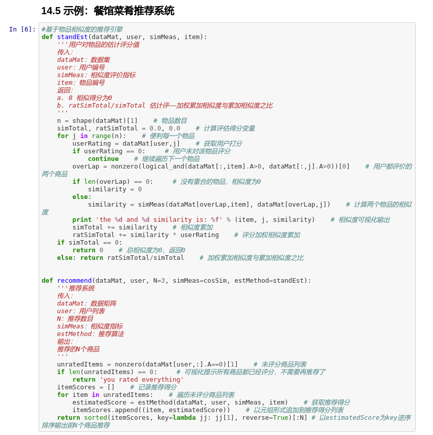

# machineLearningInAction
## Requires
- Python 2.7
- numpy >= 1.11
## Features
- Implement with Jupyter Notebook
  > + 02KNN.ipynb
  > + 03decisionTree.ipynb
  > + 04NaiveBayes.ipynb
  > + 05LogisticRegression.ipynb
  > + 06SVM.ipynb
  > + 07AdaBoost.ipynb
  > + 08LinearRegression.ipynb
  > + TODO
  > + TODO
  > + TODO
  > + TODO
  > + 13PCA.ipynb
  > + 14SVD.ipynb
- More detailly comments
